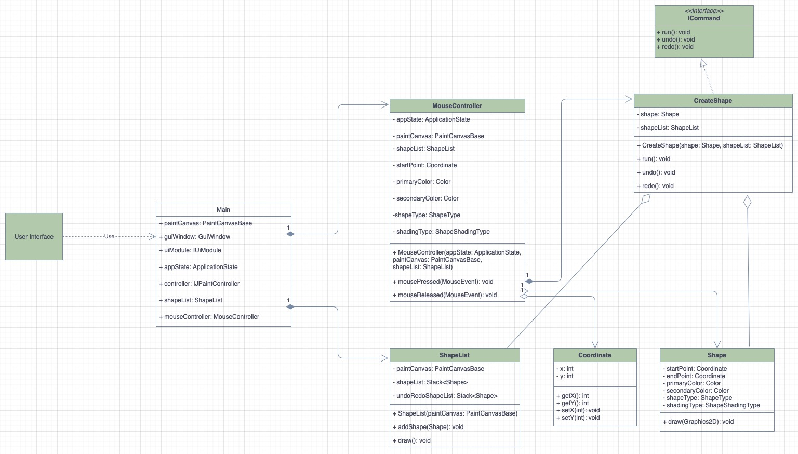
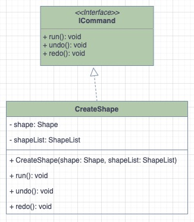

# SE450-Jpaint
## Pengju Zhang
## Sprint 1

Sprint 1 create 4 classes
1. MouseController: It helps to detect position of mouse move and store
   it to Coordinate Class for creating new shape.
2. ShapeList: Shape list is the class mainly storing shape(s) information, it helps create 
   shape on canvas and regulate undo/redo shape.
3. Shape: Class for storing individual shape information (coordinates, color, shapetype, etc.),
   and has method to draw rectangle shape.
4. CreateShape: This class initiate by MouseRelease method, every time user drag and release their
   mouse, it will pass the shape into shape list.
   
### Draw a filled-in Rectangle
Done, user are able to create rectangle shape with different color.
### Undo/Redo Draw
Done
### Have at least one design pattern implemented
  
I created an interface containing 3 factory method pattern (run, undo, redo) so other class (CreateShape in this case)
are able to implement and overwrite it with own properties.

## Sprint 2
Except factory method pattern in sprint 1, there are totally 4 new patterns implemented
1. Builder Pattern
   1. Shape class implement builder pattern so other class are able to create shape through build pattern.
2. Strategy Pattern
   1. Strategy pattern use for mouse mode run() method, this includes IStrategy interface and Context for switching mode.
3. Observer Pattern
   1. MovementAlert class implement observer pattern, it allows SelectCommand to add observer(s) (selected shape(s)), and MoveCommand to 
   update the new coordinate to all observer(s). This requires IMovementObserver interface to share similar methods.
4. MVC Pattern
   1. We already have View (UI) initiated in main, so I create ShapeList as data model and MouseController as controller to satisfy with MVC pattern
