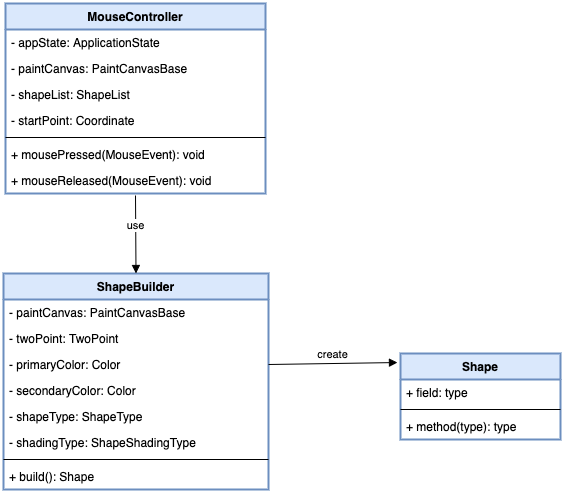
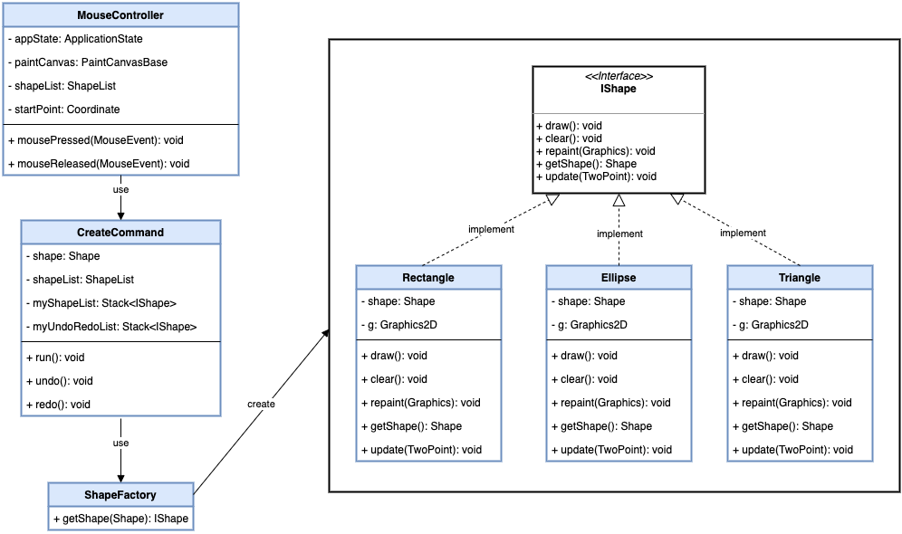
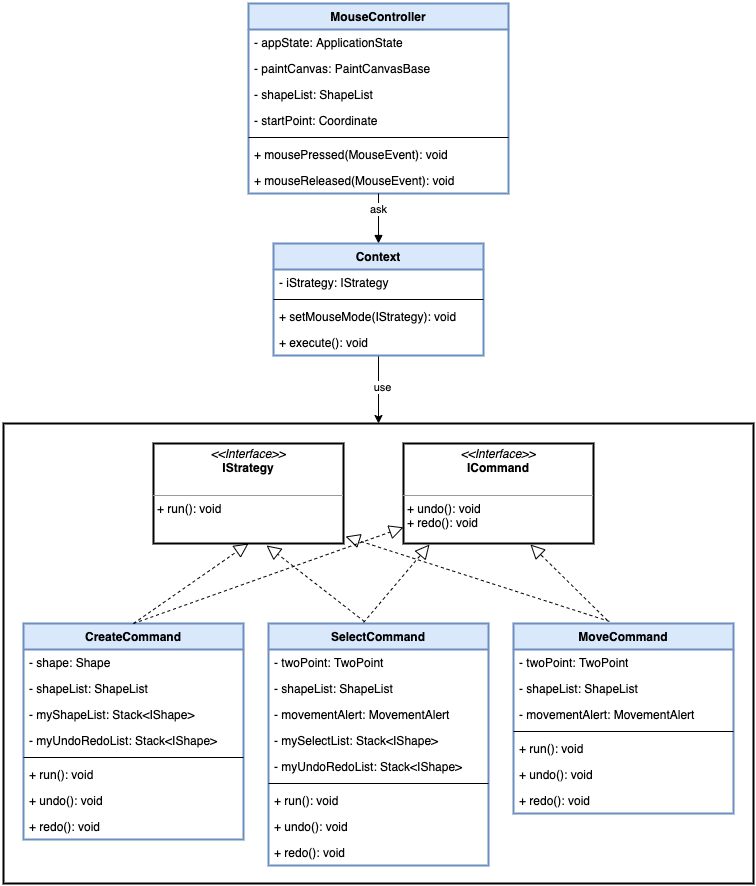
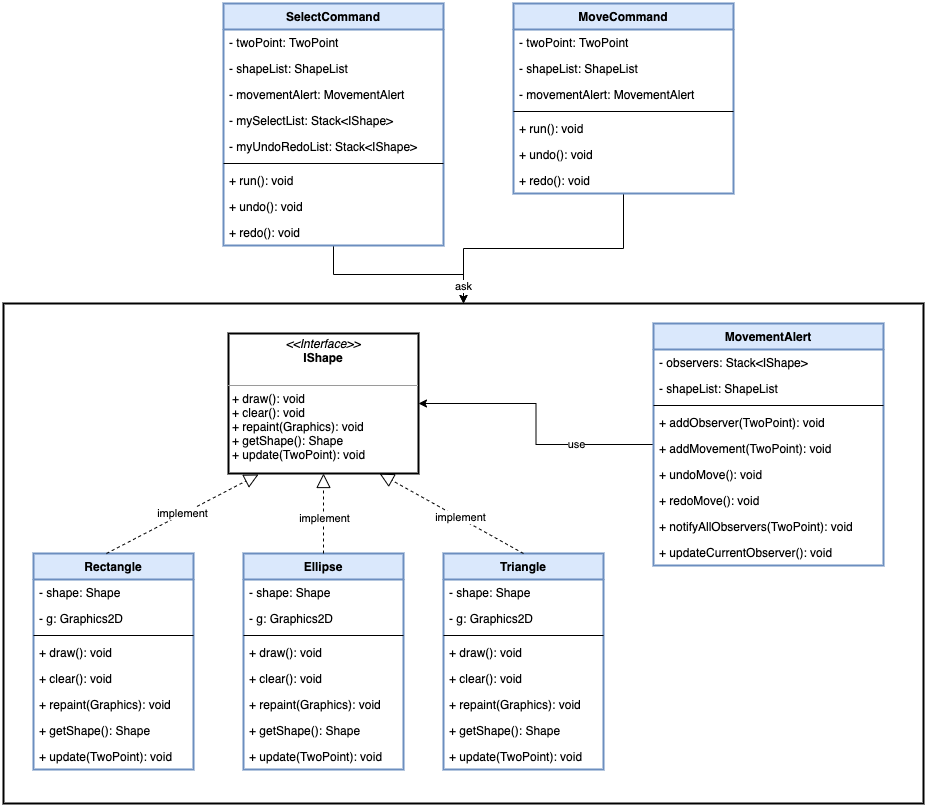
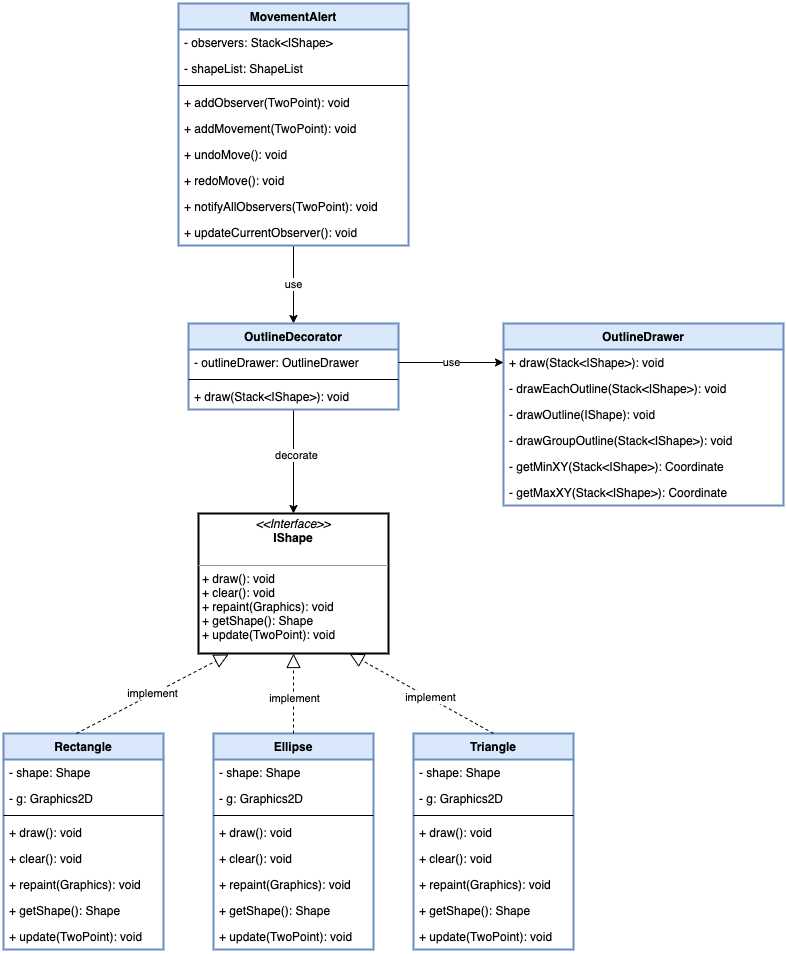
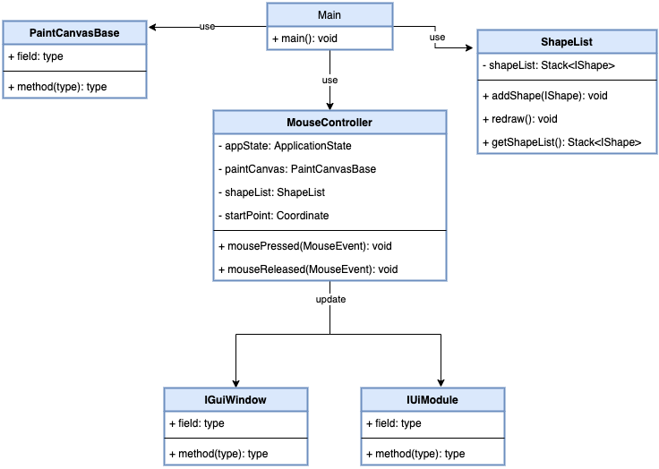

# SE450 - Jpaint Project
### 1. Builder Pattern

MouseReleased method in MouseController class 
create the ShapeBuilder class and then apply variables, 
by using build method through ShapeBuilder, it create 
individual Shape instance.

### 2. Factory Method Pattern

I create an IShape interface and three concrete classes 
that implements the IShape interface. Next, we define the 
factory class ShapeFactory so CreateShape class could use 
the ShapeFactory to get the Shape object. It will pass 
information (Shape) to the ShapeFactory in order to get 
the type of object it needs.

### 3. Strategy Pattern

Normally we use if…else… statement to initiate every action 
for create, select and move shape. Since their action are 
same by using run() method, thus I separate them into each 
package as CreateCommand, SelectCommand and MoveCommand, 
and create IStragegy interface for only run() method, and 
Context class is able to apply the method through IStrategy.

### 4. Observer Pattern

In this case, IShape is observer interface implemented 
by Rectangle, Ellipse and Triangle. And both SelectCommand 
and MoveCommand act as client to add and update shape 
information through MovementAlert class.

### 5. Decorator Pattern

In OutlineDecorator class I create a method to outline the 
list of IShape object(s), since all three shape implement 
IShape, this allows behavior to be added to an individual 
shape without affecting the behavior of other objects from 
the same class.

### 6. MVC Pattern

ShapeList object has been created in Main as a shape data 
storage, IGuiWindow and IUiModule are view classes that outputs 
shape(s) details to the window console, MouseController is a controller 
class that stores data into the ShapeList object and updates the view 
through PaintCanvasBase accordingly.